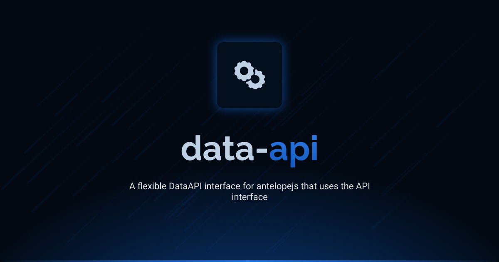

# @antelopejs/data-api

<div align="center">
<a href="https://www.npmjs.com/package/@antelopejs/data-api"></a>
<a href="./LICENSE"></a>
<a href="https://discord.gg/sjK28QHrA7"></a>
<a href="https://antelopejs.com/modules/data-api"></a>
</div>

A module that provides data-api interfaces only, without implementation code.


## Installation

```bash
ajs project modules add @antelopejs/data-api
```

## Interfaces

This module implements the Data API interface it provides a standardized way to interact with data sources in your application. The interface is installed separately to maintain modularity and minimize dependencies.

| Name          | Install command                         |                                                                   |
| ------------- | --------------------------------------- | ----------------------------------------------------------------- |
| Data API      | `ajs module imports add data-api`       | [Documentation](https://github.com/AntelopeJS/interface-data-api) |

## License

This project is licensed under the Apache License 2.0 - see the [LICENSE](LICENSE) file for details.
